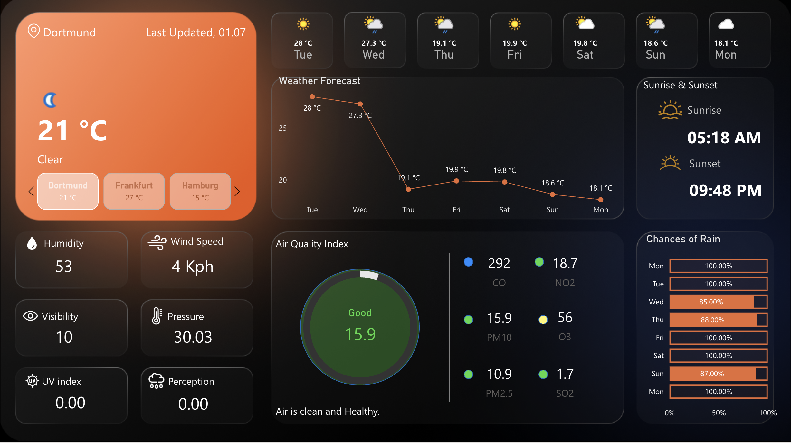

# Real-Time-Weather-Dashboard





This project features a dynamic and visually appealing weather forecast dashboard built using Microsoft Power BI. It leverages a live API connection to [weatherapi.com](https://www.weatherapi.com/) to display real-time weather data, which is refreshed daily through scheduled updates in the Power BI service.

Interactive Dashboard link: https://app.powerbi.com/view?r=eyJrIjoiOWJjOTdkMmEtMWNkYy00MWQyLTk2YjUtYmIzMzJjOTI2OGVhIiwidCI6ImRmODY3OWNkLWE4MGUtNDVkOC05OWFjLWM4M2VkN2ZmOTVhMCJ9

## 📋 Table of Contents

  - [Project Overview](https://www.google.com/search?q=%23-project-overview)
  - [Features](https://www.google.com/search?q=%23-features)
  - [Technologies Used](https://www.google.com/search?q=%23-technologies-used)
  - [Data Source](https://www.google.com/search?q=%23-data-source)
  - [Setup and Configuration](https://www.google.com/search?q=%23-setup-and-configuration)
  - [Usage](https://www.google.com/search?q=%23-usage)
  - [Future Enhancements](https://www.google.com/search?q=%23-future-enhancements)
  - [Acknowledgements](https://www.google.com/search?q=%23-acknowledgements)

## 📝 Project Overview

This dashboard provides a comprehensive, at-a-glance view of the current and forecasted weather conditions for a selected location. The primary goal of this project was to demonstrate the capabilities of Power BI in creating beautiful and functional dashboards by connecting to and visualizing real-time data from a web API.

## ✨ Features

The dashboard includes a variety of visualizations and data points for a comprehensive weather overview:

  * **Current Weather:** Displays the current temperature, weather condition (e.g., Clear), and an intuitive icon.
  * **Location Selection:** Allows users to switch between pre-configured cities (e.g., Dortmund, Frankfurt, Hamburg).
  * **7-Day Weather Forecast:** A line graph showing the temperature trend for the upcoming week.
  * **Sunrise & Sunset Times:** Clearly indicates the day's sunrise and sunset times.
  * **Key Weather Metrics:**
      * **Humidity:** Percentage of air humidity.
      * **Wind Speed:** Current wind speed in Kph.
      * **Visibility:** Current visibility distance.
      * **Pressure:** Atmospheric pressure.
      * **UV Index:** The strength of the sun's ultraviolet radiation.
      * **Perception:** Current perception data.
  * **Air Quality Index (AQI):**
      * A central gauge providing an overall AQI score and a qualitative assessment (e.g., "Good").
      * Detailed breakdown of key pollutants:
          * CO (Carbon Monoxide)
          * NO2 (Nitrogen Dioxide)
          * PM10 (Particulate Matter 10)
          * O3 (Ozone)
          * PM2.5 (Particulate Matter 2.5)
          * SO2 (Sulphur Dioxide)
  * **Chances of Rain:** A bar chart illustrating the probability of rain for each day of the week.

## 🛠️ Technologies Used

  * **Data Visualization:** Microsoft Power BI
  * **Data Source:** [WeatherAPI.com](https://www.weatherapi.com/)
  * **Data Connectivity:** Power Query using a Web API connector.
  * **Hosting & Refresh:** Power BI Service for scheduled daily data refreshes.

## 📊 Data Source

The weather and air quality data for this dashboard is sourced from [weatherapi.com](https://www.weatherapi.com/). It provides a reliable and detailed weather and geo-data API.

## ⚙️ Setup and Configuration

To replicate this project, you will need:

1.  **Power BI Desktop:** The primary development environment for the dashboard.
2.  **API Key:** Sign up on [weatherapi.com](https://www.weatherapi.com/) to get a free API key.
3.  **Power Query:**
      * In Power BI Desktop, go to "Get Data" -\> "From Web".
      * Enter the API endpoint URL from weatherapi.com. You will need to insert your API key and the desired location into the URL string. For example:
        ```
        https://api.weatherapi.com/v1/forecast.json?key=YOUR_API_KEY&q=Dortmund&days=7&aqi=yes&alerts=no
        ```
      * Use Power Query Editor to transform and clean the JSON data returned by the API into a tabular format suitable for visualization.
4.  **Power BI Service:**
      * Publish the report from Power BI Desktop to the Power BI Service.
      * Navigate to the dataset settings and configure the scheduled refresh to keep the data up-to-date automatically.

## 🚀 Usage

Once the dashboard is published to the Power BI Service, it can be accessed through a web browser or the Power BI mobile app. The dashboard is designed to be interactive, allowing users to hover over data points for more details and to switch between different locations.

## 🔮 Future Enhancements

  * **Historical Weather Data Analysis:** Incorporate historical data to analyze weather trends over time.
  * **Alerts & Notifications:** Set up data-driven alerts for specific weather conditions (e.g., high UV index, poor air quality).
  * **Expanded Location Options:** Implement a dynamic location lookup feature to allow users to search for any city worldwide.
  * **Integration with other Data:** Combine weather data with other datasets, such as sales data or event schedules, to uncover correlations.

## 🙏 Acknowledgements

  * **Data:** A special thank you to [weatherapi.com](https://www.weatherapi.com/) for providing the free and comprehensive weather data API.
  * **Tools:** This project was made possible by the powerful data visualization capabilities of Microsoft Power BI.
